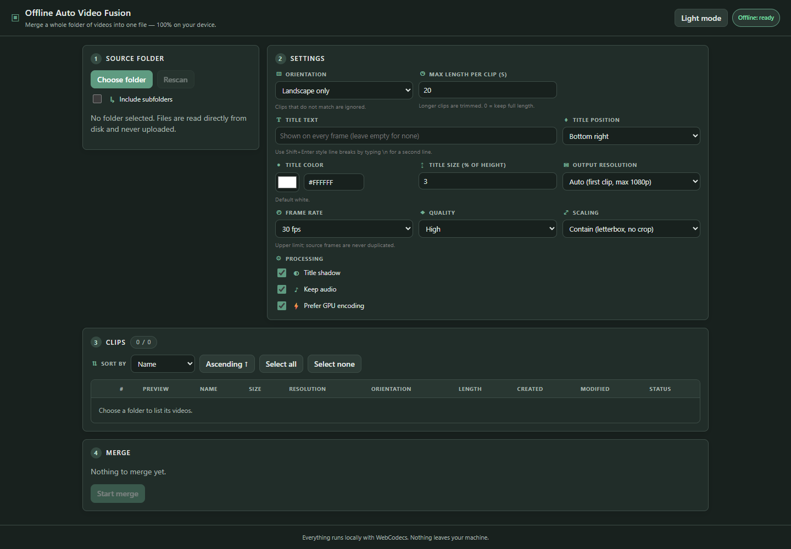
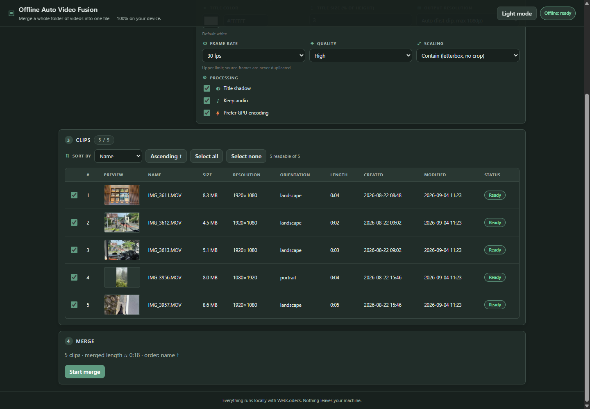
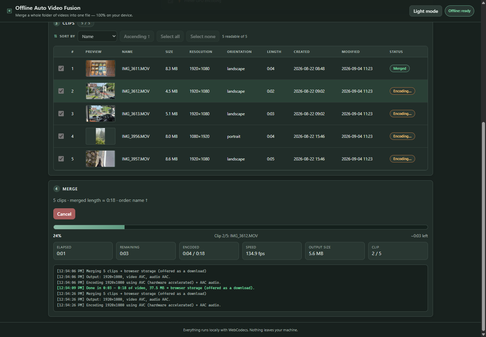
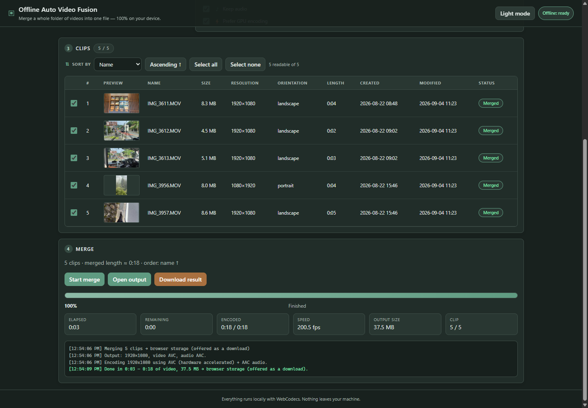
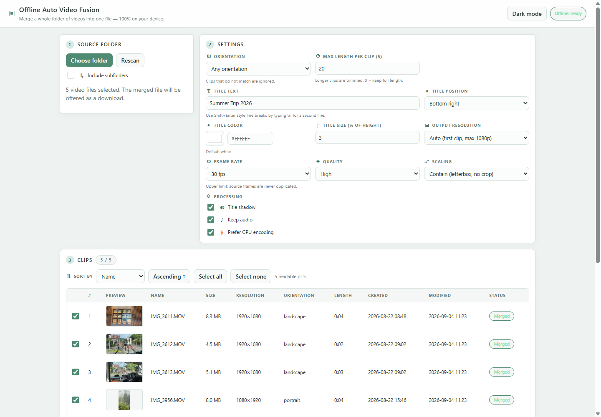

# Offline Auto Video Fusion

Merge every video in a local folder into one file — entirely in the browser.
Nothing is uploaded, nothing is installed, and once the page has been loaded it keeps working
even when the server is gone.



## Contents

- [Quick start with Docker](#quick-start-with-docker)
- [Quick start without Docker](#quick-start-without-docker)
- [Using the app](#using-the-app)
- [Deployment](#deployment)
- [What it does](#what-it-does)
- [How it stays fast and light on memory](#how-it-stays-fast-and-light-on-memory)
- [Stabilization](#stabilization)
- [Face privacy](#face-privacy)
- [Offline](#offline)
- [Browser support](#browser-support)
- [Project layout](#project-layout)

## Quick start with Docker

The app is a static bundle: the image builds it with Node and serves it with nginx. There is no
backend and no database — the container only hands out HTML, CSS, JS and the service worker.

```bash
cp .env.example .env              # ports live here; .env is git-ignored
docker compose up -d --build      # build the bundle and serve it
# open http://localhost:8080      (or whatever APP_PORT you set)
docker compose logs -f app        # follow nginx logs
docker compose down               # stop and remove the container
```

On Windows: `Copy-Item .env.example .env`.

### Ports are configured in `.env`

All ports come from environment variables, so changing them is a local-only edit that can never be
pushed by accident. [`.env.example`](.env.example) is the tracked template; `.env` is ignored by
both git and Docker.

| Variable | Default | Used by |
| --- | --- | --- |
| `APP_PORT` | `8080` | host port of the nginx container (`docker compose up app`) |
| `DEV_PORT` | `5173` | Vite dev server — the `dev` compose service *and* `npm run dev` |
| `PREVIEW_PORT` | `4173` | `npm run preview` |

Every variable has a fallback baked into [`docker-compose.yml`](docker-compose.yml) and
[`vite.config.ts`](vite.config.ts), so the project still runs when `.env` is missing — a fresh
clone works before anything is copied. Shell variables take precedence over the file, which is
handy for a one-off run or for CI:

```bash
APP_PORT=3000 docker compose up -d --build     # http://localhost:3000
```

### Development container (hot reload)

```bash
docker compose --profile dev up dev            # Vite dev server on http://localhost:$DEV_PORT
```

The `dev` service bind-mounts the repository into the container, so edits on the host reload
instantly. `node_modules` stays inside the container (an anonymous volume shadows the host copy),
so a Windows/macOS host never leaks incompatible native binaries into the Linux image. `DEV_PORT` is
passed into the container and used on both sides of the mapping, so the URL Vite prints is the one
that works from the host.

### What is in the image

| Stage | Base | Purpose |
| --- | --- | --- |
| `deps` | `node:22-alpine` | `npm ci` once, reused by the other stages |
| `dev` | `node:22-alpine` | Vite dev server, port from `DEV_PORT` |
| `build` | `node:22-alpine` | `npm run build` → `dist/` incl. the generated service worker |
| `runtime` | `nginx:1.27-alpine` | serves `dist/` on port 80, has a `HEALTHCHECK` |

The nginx config lives in [`docker/nginx.conf`](docker/nginx.conf). It caches `/assets/*` (content
hashed by Vite) for a year, forbids caching of `sw.js` and `index.html` so a new deploy is picked up
on the next reload, serves `manifest.webmanifest` with the right MIME type and gzips text assets.

The container always listens on port 80 internally — only the published port is configurable — so
building or running the image without Compose stays straightforward:

```bash
docker build -t auto-video-fusion .
docker run --rm -p 8080:80 auto-video-fusion
```

## Quick start without Docker

```
npm install
cp .env.example .env   # optional: only needed to change ports
npm run build          # bundles the app + generates the offline service worker
npm run preview        # serve dist/ at http://localhost:4173 ($PREVIEW_PORT)
```

For development: `npm run dev` (http://localhost:5173, or `$DEV_PORT`) and `npm run typecheck`.

## Using the app

Open the page in Chrome or Edge. The badge in the header tells you whether the offline cache is
ready; a second badge appears if the browser is missing a required capability.

**1 · Pick the source folder.** *Choose folder* opens the native directory picker; tick *Include
subfolders* to scan recursively. The files are read straight from disk — they are never uploaded,
copied or duplicated. Browsers without the File System Access API fall back to a multi-file picker
instead.

**2 · Configure the merge.** Every control applies to all clips and is remembered between sessions:

| Setting | Meaning |
| --- | --- |
| Orientation | Only clips matching *landscape* / *portrait* are merged (*any* disables the filter). Skipped clips still show up in the list. |
| Max length per clip | Longer clips are trimmed to this many seconds; `0` keeps the full length. |
| Resolution | *Auto* (default) keeps the first clip's size. A preset rescales the frame so its short edge is 2160/1440/1080/720/480. |
| Aspect ratio | *Auto* (default) keeps the first clip's shape. Pick 16:9, 9:16, 4:3, 3:4, 1:1, 4:5 or 21:9 to force a different frame. |
| Title text / position / color / size | Text burned into every frame, at one of 9 positions. `\n` starts a second line. |
| Frame rate | Upper limit — source frames are never duplicated to reach it. *Auto* (default) matches the fastest selected clip, or falls back to a 120 fps limit when no source rate can be detected. |
| Stabilizer | Software stabilization applied automatically to **every** clip. *Off* (default) skips it entirely; *Light* / *Standard* / *Strong* trade an increasing crop for an increasingly steady picture. See [Stabilization](#stabilization). |
| Face privacy | Automatically finds human faces and hides them. *Off* (default) skips detection entirely; *Blur faces* / *Blur faces (strong)* soften them, *Pixelate faces* replaces them with blocks. See [Face privacy](#face-privacy). |
| GPS mini map | An optional GPS group accepts GPX, KML, GeoJSON or CSV and previews the route in the shared output preview before merging. Timestamped tracks align to each video's creation metadata; embedded video coordinates are used as a fallback anchor. |
| Mini map display | Places the overlay in any corner, defaults to 25% of the video width, sizes it from 15–50%, adjusts its opacity, rotates it through 0–359°, chooses a plain or illustrative offline-map background, and independently shows, hides, or reorders speed, altitude profile, traveled distance, coordinates, and the video's date and time. |
| Acceleration | How much of the machine the merge may use. *Auto* (default) sizes the pipeline from the detected GPU, core count and memory; *Maximum* pushes further on a workstation; *Balanced* leaves headroom for other work; *Compatibility* falls back to the strictly sequential pipeline. The detected GPU is written to the log when the app starts. |

With both frame controls on *auto* the output is exactly the first clip's frame, and clips of a
different shape are letterboxed into it. As soon as either one is set, the frame is forced and
**every clip that does not fit it is cropped to fill** instead. The two controls are independent:
the ratio picks the shape and the resolution picks the size, so forcing only the ratio keeps the
first clip's short edge and therefore its level of detail. If the encoder cannot handle the
requested size, the frame is scaled down automatically and a warning is logged.

Quality, title shadow, and audio use their optimized defaults. Processing always requests GPU
encoding and falls back to software automatically when hardware encoding is not available.

GPS CSV files need `latitude` and `longitude` columns and may also include `time`/`timestamp`,
`elevation` and `speed` (metres per second). A timestamped point must have a timestamp on every row.
Untimed routes are advanced across each clip by relative progress. The mini map uses no online map
tiles, so GPS rendering remains private and works offline. Its built-in cartographic background adds
illustrative streets, blocks, water and a rotating north indicator for visual route context; it is
not live road data. Enabling *Altitude graph* adds the complete elevation profile under the route,
with a moving progress marker and the current interpolated altitude. Enabling *Date & time* shows
the video's recording time and advances it with each frame when creation metadata is available.
Altitude, distance, and date/time are enabled by default. Use the arrow controls to set their
top-to-bottom order. Click the preview, or its *Full screen* button, to inspect it full screen.

The **Text & GPS overlays** section keeps the title controls and the GPS controls in one panel,
split by a separator, and both share a single live preview to save space. The preview follows the
selected aspect ratio (or the first eligible clip in *Auto*) and shows the title style together
with the selected mini map size, corner, opacity and information fields in the same output frame.

**3 · Review the clips.** Each clip is probed in a worker: resolution, orientation, duration, dates
and a decoded thumbnail. Sort by name, modified or created date (ascending/descending) — **the list
order is exactly the order in which clips are concatenated** — and untick anything you do not want.



**4 · Merge.** *Start merge* writes the result directly into the selected folder as
`merged-<date>-<time>.mp4` (or offers a download when the folder cannot be written to). The progress
panel shows percentage, current clip, ETA, elapsed time, encode speed, output size and a log;
*Cancel* stops and discards the partial file.



When it is done, every merged clip is marked and *Open output* / *Download result* appear next to
the summary.



The header toggle switches between the dark and the light theme; the choice is persisted along with
the other settings.



## Deployment

The build output in `dist/` is fully static — any web server or object storage works. The container
above is only a convenient, reproducible way to do it.

**Serve it from a secure context.** WebCodecs and the File System Access API are only available on
`https://` or on `http://localhost`. Testing on `http://localhost:$APP_PORT` is fine; exposing the
container on a LAN IP over plain HTTP is not — put a TLS-terminating reverse proxy in front of it
(`8080` below is the `APP_PORT` from your `.env`):

```nginx
server {
    listen 443 ssl;
    server_name fusion.example.com;
    ssl_certificate     /etc/letsencrypt/live/fusion.example.com/fullchain.pem;
    ssl_certificate_key /etc/letsencrypt/live/fusion.example.com/privkey.pem;

    location / {
        proxy_pass http://127.0.0.1:8080;
        proxy_set_header Host $host;
        proxy_set_header X-Forwarded-Proto $scheme;
    }
}
```

Other notes:

- **Subfolders work.** Vite is configured with `base: './'`, so the bundle can be served from
  `https://example.com/tools/fusion/` without a rebuild.
- **Ports are per-machine.** Set `APP_PORT` in `.env` (git-ignored) or in the deploy environment;
  nothing about the host is baked into a tracked file.
- **Deploying a new version** only requires replacing the container or the files. `sw.js` and
  `index.html` are served with `no-cache`, so the next reload installs the new precache and drops
  the old one.
- **The container is stateless.** No volumes, no user data, nothing to back up — videos never leave
  the machine that runs the browser. It also runs read-only if you want:
  `docker run --read-only --tmpfs /var/cache/nginx --tmpfs /var/run -p 8080:80 auto-video-fusion`.
- **Static hosting** (GitHub Pages, S3, Netlify, …): upload `dist/` and make sure `sw.js` is not
  cached aggressively.
- **File permissions.** Everything under `public/` is copied into `dist/` with the permissions it
  had in the checkout, so a clone made with a restrictive umask (common on NAS boxes) can leave
  `manifest.webmanifest` and the icons unreadable for the unprivileged nginx worker — it answers
  `403` and the offline badge reports `Offline: incomplete`. The `runtime` image normalises the
  modes itself; when copying `dist/` somewhere by hand, do the same:
  `chmod -R a=rX,u+w dist`.

## What it does

- **Pick a local folder** with the File System Access API. The files are read straight from disk —
  they are never uploaded, copied or duplicated.
- **Merge all videos in that folder** into a single MP4, in the order you choose.
- **Orientation filter** (default *landscape*): clips that don't match are listed but ignored.
- **Per-clip length limit** (default *20 s*): longer clips are trimmed, `0` keeps the full length.
- **Automatic software stabilization** (default *off*): once switched on, every clip is stabilized
  with optical-flow motion tracking — no per-clip setup. See [Stabilization](#stabilization).
- **Automatic face blurring** (default *off*): faces are detected on your own machine and blurred
  or pixelated in the merged video, with no per-clip setup. See [Face privacy](#face-privacy).
- **Title text burned into every frame**, with 9 positions (default *bottom right*) and a free
  colour (default *white*), an adjustable size and an optional shadow for legibility.
- **Sorting by name, modified date or created date**, ascending or descending. The list order is
  exactly the order in which the clips are concatenated.
- **Thumbnail preview per clip**: while a clip's metadata is read, one early frame is decoded in the
  worker and shown next to it in the list (rotation metadata applied, so portrait clips stand
  upright). Clips whose first frames cannot be decoded simply show a placeholder.
- **Progress bar with ETA**, live encode speed, output size, clip counter, and a cancel button.
- **The result is written directly into the selected folder** as `merged-<date>-<time>.mp4`
  (previous outputs are automatically ignored when the folder is scanned again).

## How it stays fast and light on memory

| Concern | Approach |
| --- | --- |
| GPU usage | Decoding and encoding run through **WebCodecs**, which uses the platform's hardware video engine (NVDEC/NVENC, Quick Sync, VCN). Both the decoders and the encoder are asked for `prefer-hardware` when the browser reports that the configuration is supported, and each falls back automatically otherwise — a clip whose hardware decode fails is retried in software rather than dropped. |
| Keeping the hardware busy | Several clips are demuxed, decoded and composited **at the same time**, in concurrent lanes that run ahead of the encoder, so the encoder never waits for the next frame to be decoded and the GPU's decode and encode blocks work in parallel. The lane count and the look-ahead are derived from the detected GPU, core count and memory (see `src/lib/hardware.ts`) and can be overridden with the *Acceleration* setting. Folder metadata is read by a small pool of workers for the same reason. |
| Compositing | Frames are scaled, letterboxed/cropped and stamped with the title on a GPU-backed `OffscreenCanvas` inside a worker, so the UI thread never blocks. The title is rasterised **once** into a bitmap and then blitted per frame. Finished frames never cross a worker boundary — that would force a read-back out of GPU memory, which measured about four times slower than compositing and encoding on the same thread. |
| Memory | The look-ahead is a *memory budget*, not a frame count: each lane may only run a few frames ahead, sized so all lanes together stay inside a fraction of system memory (capped at 768 MB) whatever the resolution. Each frame is closed immediately after use, and every `add()` call is awaited so backpressure from the encoder and from the disk writer propagates all the way back into the read loops. The muxed file is streamed to disk in 8 MiB chunks through a `FileSystemWritableFileStream`, so a 2-hour output uses no more memory than a 2-second one. Browsers without the File System Access API stream into private browser storage instead, so the result never has to be assembled in RAM either. |
| Wasted work | Frames arriving faster than the target frame rate are dropped before they reach the compositor, and frames are never duplicated when a source runs slower. |

Codec selection tries AVC → HEVC → AV1 → VP9 and picks the first one the browser can encode at the
chosen resolution; audio is re-encoded to AAC (or Opus) at 48 kHz stereo. Clips without a usable
audio track — or with an audio track the browser refuses to decode — are padded with silence so the
merged timeline stays in sync.

## Stabilization

Turning the *Stabilizer* setting on makes every clip in the merge get stabilized automatically —
there is nothing to mark up per clip. It is off by default because it is the one setting that costs
real time.

The algorithms come from **OpenCV** via [`@techstark/opencv-js`](https://www.npmjs.com/package/@techstark/opencv-js),
a WebAssembly build of the library. Nothing about that changes the offline promise: the WASM is
bundled with the app and precached by the service worker like every other asset, so stabilization
works with the network unplugged too.

**How a clip is stabilized.** [`src/lib/stabilizer.ts`](src/lib/stabilizer.ts) implements the
standard two-pass approach:

1. **Measure.** The clip is decoded once at a reduced size (long edge 480 px) and, for each pair of
   consecutive frames, `goodFeaturesToTrack` picks trackable corners, `calcOpticalFlowPyrLK`
   follows them into the next frame, and `estimateAffine2D` fits the motion that best explains where
   they went. RANSAC discards the points that disagree, which is what keeps a car driving through
   the shot from being mistaken for the camera moving. Adding those deltas up gives the path the
   camera actually took.
2. **Smooth.** That path is smoothed, and the gap between the smoothed and the measured path is the
   correction each frame needs. Before smoothing, the path's straight-line trend is removed and
   added back afterwards — without that step a steady pan is read as a slowing one, and the result
   is a picture that visibly drags sideways at the start and end of every clip.
3. **Apply.** While the clip is encoded, each frame is drawn shifted and rotated by its correction
   and zoomed just enough to keep the uncovered edges outside the frame. The zoom is computed from
   the corrections the clip actually needed, so steady footage is not cropped at all.

Only translation and rotation are corrected. `estimateAffine2D` also reports scale and shear, but in
handheld footage those are parallax and noise rather than shake, and "correcting" them warps the
picture instead of steadying it.

| Preset | Smoothing window | Maximum crop | Good for |
| --- | --- | --- | --- |
| Light | ±10 frames | 4 % | Deliberate camera work you want to keep — pans and follows stay intact |
| Standard | ±22 frames | 8 % | Handheld footage |
| Strong | ±40 frames | 14 % | Walking, action cams, anything badly shaken |

A stronger preset smooths over a longer stretch of time, which needs a bigger correction and
therefore a bigger crop to hide the edges it uncovers. The crop is a **ceiling**, not a cost: each
clip is only zoomed as far as its own corrections require.

**What it costs.** The measuring pass decodes every clip a second time, and the tracking itself is
CPU work that cannot be handed to the GPU the way encoding can. Expect a stabilized merge to take
roughly two to four times as long, depending on how much of the decoding the hardware takes on.
Clips are analyzed in the same parallel lanes that render them, so the cost is spread across
threads rather than added as a serial step in front of the merge.

**When it cannot help.** A clip with nothing trackable in it (a blank sky, heavy motion blur) is
merged unstabilized and a warning is logged; the same happens if OpenCV fails to load. Stabilization
is never allowed to cost you a clip.


## Face privacy

*Face privacy* finds human faces in every clip and hides them in the merged video, so footage can
be shared without exposing bystanders. It is **off by default** and costs a detection pass per
frame when enabled.

Detection uses the Haar cascade classifier from OpenCV's `objdetect` module. The model is bundled
with the app and precached by the service worker, so — like everything else here — enabling this
sends nothing anywhere and works with the network off. Frames are never uploaded.

**How a frame is processed** ([`src/lib/face-blur.ts`](src/lib/face-blur.ts)):

1. **Detect** on a copy of the frame scaled to a 360 px long edge. Faces are coarse features, so
   the small copy finds them as reliably as the full frame at a fraction of the cost. Scaling by the
   long edge keeps landscape and portrait clips equally expensive. The copy is contrast-equalized
   first, which is what finds faces that are back-lit or in shadow.
2. **Track** the boxes across frames. Haar detection flickers — a face that turns slightly drops out
   for a few frames — so a box keeps being covered for about a third of a second after the detector
   last saw it, and is then dropped. This stops a face from flashing into view mid-clip.
3. **Obscure** each box on the full-resolution frame by resampling it through a tiny buffer, which
   destroys the detail irreversibly. Smooth upscaling reads as a blur; unsmoothed upscaling reads as
   pixelation. Blurred regions are clipped to an ellipse so they follow a head instead of looking
   like a pasted-on rectangle.

Detection runs every other frame and the tracked boxes cover the frames in between, which keeps the
added cost near 10 ms per frame rather than 30.

Faces are hidden **before** the title and the GPS mini map are drawn, so overlays always stay sharp.

**Limits worth knowing.** The cascade detects *front-facing* faces; a full profile, a face turned
far from the camera, or one that is heavily occluded may be missed, and the occasional false
positive may blur a face-like patch of background. It is a strong privacy aid, not a guarantee —
**check the output before publishing**. If the model or OpenCV fails to load, the clip is still
merged, but an **error** is logged saying faces are not obscured, because silently publishing
unblurred faces would be far worse than a noisy failure.

The bundled model is
[`haarcascade_frontalface_default.xml`](src/assets/haarcascade_frontalface_default.xml) from the
[OpenCV](https://github.com/opencv/opencv) project, redistributed under the BSD-style license
reproduced in the file's own header.


### Mixed audio formats

You do not have to care about the channel layout or sample rate of the source clips. An encoder is
configured once from the first sample it receives and then rejects anything shaped differently
(*"Audio parameters must remain constant. Expected 1 channels at 48000 Hz, got 2 channels at
48000 Hz"*), which otherwise breaks as soon as a mono clip is followed by a stereo one.

[`src/lib/audio.ts`](src/lib/audio.ts) therefore converts **every** sample — decoded audio and
generated silence alike — to one canonical layout (48 kHz stereo) *before* it reaches the encoder:

* mono is duplicated to both channels, multi-channel layouts are folded down to the front pair;
* differing sample rates are resampled with interpolation that carries its phase and a small tail
  across buffer boundaries, so consecutive chunks join without clicks or drift;
* samples that already match are passed straight through, so the common case costs nothing.

Should anything about the audio still fail at runtime, the audio track is dropped and the merge
continues — a bad audio track never costs you the video.

## Offline

`npm run build` runs `scripts/build-sw.mjs`, which hashes every file in `dist/` and writes a
service worker that precaches all of them. Load the page once over HTTP(S); afterwards the shell,
the worker bundle and the codec logic are served from the cache. Verified by shutting the server
down completely and merging clips with the page still open (and after a reload).

Entries are stored one at a time instead of with `cache.addAll`, which is atomic: a single asset the
server refuses to serve would otherwise abort the whole install and leave the page with no worker at
all. The worker reports its progress to the page, so the badge in the header shows what is going on:

| Badge | Meaning |
| --- | --- |
| `Offline: caching 42%` | precache in progress — the tooltip gives the exact file count |
| `Offline: ready` | every file is cached; the app runs with no network |
| `Offline: incomplete (n)` | the worker is active but `n` files could not be fetched; the tooltip and the log name them |
| `Offline: failed` | the worker could not be installed at all |
| `Offline: dev mode` | caching is disabled under `npm run dev` |

An `Offline: incomplete` badge almost always means the server rejected those files — see the file
permissions note under [Deployment](#deployment).

The OpenCV WebAssembly build behind the [stabilizer](#stabilization) is precached along with
everything else, so stabilization works offline too. It is by far the largest asset (~10 MB, which
dominates the precache), and it is split into its own chunk that the app only *executes* when a
merge actually uses the stabilizer — leaving the setting off costs nothing at runtime.

## Browser support

| Feature | Requirement |
| --- | --- |
| Folder picking + writing the result into that folder | File System Access API — Chrome/Edge (Chromium) 86+ |
| Decoding/encoding | WebCodecs — Chrome/Edge 94+ |
| Fallback | Browsers without the File System Access API get a `webkitdirectory` file input; the merged file is streamed into private browser storage and then offered as a download. Browsers without WebCodecs cannot run the merge at all. |

The app must be served from a secure context (`https://` or `http://localhost`).

## Project layout

```
index.html                     UI markup
src/styles.css                 black & white theme
src/main.ts                    folder scanning, clip list, settings, progress UI
src/worker/pipeline.worker.ts  probing, the render lanes, and the encode → mux stage
src/worker/clip-renderer.ts    per-clip demux → decode → composite work run by each lane
src/lib/hardware.ts            GPU/CPU detection and the lane + look-ahead budget it derives
src/lib/stabilizer.ts          optical-flow motion analysis, trajectory smoothing, frame correction
src/lib/face-blur.ts           Haar face detection, box tracking, and the blur/pixelate pass
src/assets/                    the bundled face detection model (OpenCV Haar cascade)
src/lib/opencv.ts              lazy OpenCV.js loader (isolates its thenable module object)
src/lib/audio.ts               normalizes any channel layout / sample rate to 48 kHz stereo
src/lib/                       formatting helpers and persisted settings
src/dev/test-media.ts          dev-only fixture generator (not part of the bundle)
scripts/build-sw.mjs           generates dist/sw.js with the precache manifest
scripts/build-icons.mjs        regenerates public/favicon.ico and the PNG icons from icon.svg (`npm run icons`)
Dockerfile                     deps → dev / build → nginx runtime
docker-compose.yml             `app` (nginx) and `dev` (Vite) services, ports from .env
.env.example                   port template — copy to .env (git-ignored)
docker/nginx.conf              static serving, caching and gzip rules
docs/screenshots/              images used by this README
```

`window.autoVideoFusion` exposes `addFiles`, `applySettings`, `start` and `state` so the pipeline
can be driven from the console or from an automated browser test without touching the native
folder picker.
